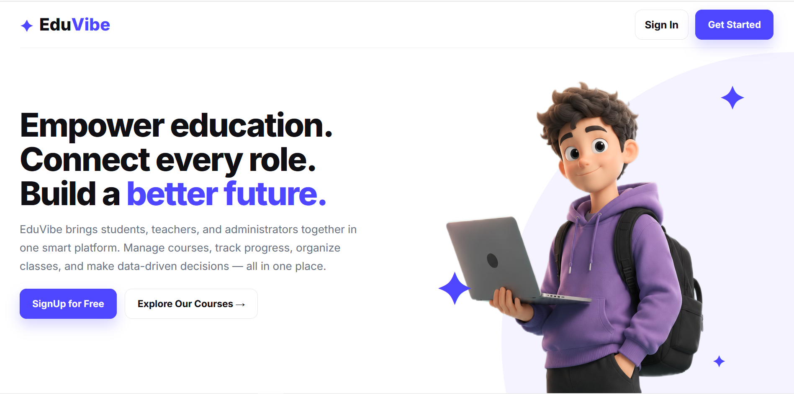
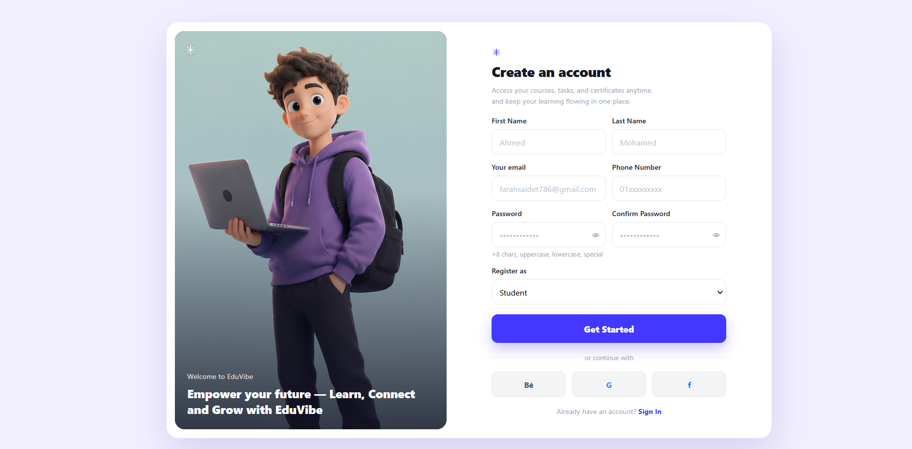
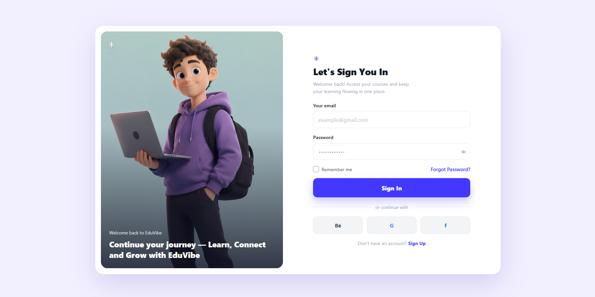

# EduVibe - Student Management System API

A .NET 9 Web API for a courses platform, built with a clean 3-Layer Architecture (PL / BLL / DAL).



## Table of Contents

- [Architecture](#architecture)
- [Tech Stack](#tech-stack)
- [Current Features](#current-features)
- [API Endpoints](#api-endpoints)
  - [Register](#register)
  - [Login](#login)
- [Prerequisites](#prerequisites)
- [Setup](#setup)
- [Configuration](#configuration)
- [Database](#database)
- [Security Notes](#security-notes)
- [Deployment](#deployment)
- [Frontend](#frontend)
- [Roadmap](#roadmap)
- [License](#license)

## Architecture

- **PL (Presentation Layer):** ASP.NET Core Web API, Controllers, Middlewares, Program.cs, Dependency Injection
- **BLL (Business Logic Layer):** Services, DTOs, Interfaces, AutoMapper, Validators, JWT logic
- **DAL (Data Access Layer):** EF Core, Entities, AppDbContext, Fluent API Configurations, Migrations
- **Database:** SQL Server (Code-First)
- **Frontend:** Static HTML/CSS/JS in `/Frontend` (separate from API, served independently)

## Tech Stack

- .NET 9, Entity Framework Core 9, ASP.NET Core Identity
- JWT Bearer Authentication, Role-Based Authorization (Admin, Instructor, Student)
- AutoMapper, Swagger / OpenAPI, CORS, Global Exception Middleware
- SendGrid for email, SQL Server, MonsterASP.NET hosting

## Current Features

- **Authentication:** Register, Login, JWT Access Token, Role seeding (Admin@system.com / Admin@123456)
- **Courses Platform:** Course entity with `Title`, `Description`, `DurationInHours`, `Price`, `CourseLevel` (Beginner/Intermediate/Advanced), `DepartmentId`
- **Enrollment:** Many-to-Many Student-Course via `Enrollment` table (composite key StudentId+CourseId, CreatedAt)
- **Password Reset:** `POST /api/Auth/password-reset` (send reset token to email) and `POST /api/Auth/confirm-reset` (reset with token)
- **CRUD:** Students, Instructors, Courses, Departments with filtering, sorting, pagination (PagedResponse)
- **Validation:** DataAnnotations + custom DateValidators (minimum age 18)
- **Security:** Password hashing, unique email, strict password rules, CORS for localhost:3000/5173/63342

## API Endpoints

```
POST   /api/Auth/register
POST   /api/Auth/login
POST   /api/Auth/password-reset        { email }
POST   /api/Auth/confirm-reset         { email, token, newPassword }

GET    /api/Student?SearchTerm=&SortBy=&PageNumber=&PageSize=
GET    /api/Student/{id}
POST   /api/Student
PUT    /api/Student/{id}
DELETE /api/Student/{id}

GET    /api/Course
GET    /api/Course/{id}
POST   /api/Course
PUT    /api/Course/{id}
DELETE /api/Course/{id}

GET    /api/Instructor
GET    /api/Instructor/{id}
POST   /api/Instructor
PUT    /api/Instructor/{id}
DELETE /api/Instructor/{id}

GET    /api/Department
GET    /api/Department/{id}
POST   /api/Department
PUT    /api/Department/{id}
DELETE /api/Department/{id}
```

### Register

| Frontend                                     | Endpoint                      | what it does                                                              | Request        | Response        |
|----------------------------------------------|-------------------------------|---------------------------------------------------------------------------|----------------|-----------------|
|  | **POST**   /api/Auth/register | send **access** Token & **refresh** Token & **Confirmation Code** in Mail | request sended | return response | 


### Login

| Frontend | Endpoint               | what it does                       | Request        | Response        |
|----------|------------------------|------------------------------|----------------|-----------------|
|   | **POST**   /api/Auth/login | **access** Token & **refresh** Token | request sended | return response | 


## Prerequisites

- .NET 9 SDK
- SQL Server (local or remote)
- SendGrid API Key (for password reset EMAILS)

## Setup

1. Clone the repository:

```
git clone https://github.com/AhmMed29/EduVibe.git
```

2. Configure secrets (do not edit appsettings.json directly):

```
cd PL
dotnet user-secrets init
dotnet user-secrets set "ConnectionStrings:connectionString" "Server=...;Database=...;User Id=...;Password=...;Encrypt=False"
dotnet user-secrets set "Jwt:Key" "YOUR_32+_CHAR_RANDOM_KEY_HERE"
dotnet user-secrets set "SendGridKey" "YOUR_SENDGRID_KEY"
dotnet user-secrets set "From" "noreply@yourdomain.com"
dotnet user-secrets set "Name" "EduVibe"
```

3. Apply migrations:

```
dotnet ef database update --project DAL --startup-project PL
```

Run from the solution root (folder containing EduVibe.sln).

4. Run the API:

```
dotnet run --project PL
```

Swagger will be available at `https://localhost:5001/swagger`.

## Configuration

- `PL/appsettings.json` is gitignored. Use `dotnet user-secrets` for local secrets.
- `PL/appsettings.Development.json` is also gitignored.
- `PL/Properties/PublishProfiles/*.pubxml` is gitignored (contains deploy credentials).

## Database

- Code-First with EF Core Migrations in `DAL/Migrations`.
- To create a new migration after model changes:

```
dotnet ef migrations add YourMigrationName --project DAL --startup-project PL
dotnet ef database update --project DAL --startup-project PL
```

- Current migration: `20260812160411_InitialCreate` (contains Course, Student, Instructor, Department, Enrollment, CourseSchedule, Identity tables).

## Security Notes

- Do not commit `appsettings.json`, `*.pubxml`, `.env`, or `secrets.json`. They are ignored by `.gitignore`.
- The initial commit `d69712c` contained a hardcoded JWT key which has been replaced by `PLACEHOLDER_USE_USER_SECRETS`. Rotate the key in production.

## Deployment

- Published via `dotnet publish` with `MonsterDeploy.pubxml` to MonsterASP.NET.
- Database hosted on `db63682.public.databaseasp.net`.

## Frontend

The `/Frontend` folder contains static pages (`index.html`, `pages/login.html`, `pages/register.html`, `pages/courses.html`, etc.) with `assets/css`, `assets/js`, `assets/images`, `assets/svgs`. It is not part of the .NET solution and is excluded from the build. For development, serve it separately or mark as Excluded in Rider to avoid indexing noise.

## Roadmap

- [ ] Authorize Endpoints
- [ ] Validations 
- [ ] Pagination & Filtering & Sorting 
- [ ] Middelwares Validation
- [ ] Token(Revocation) & BruteForce
- [ ] EF Core In Depth
- [ ] Deep dive in DB
- [ ] Enrollment endpoints (enroll/unenroll, my-courses)
- [ ] Use DTOs in Course/Student POST/PUT instead of entities
- [ ] Add Price to CourseDto
- [ ] Email confirmation, 2FA, Refresh token rotation
- [ ] File upload (profile images)
- [ ] Logging (Serilog), API Versioning, Rate Limiting
- [ ] Caching (In-Memory then Redis), Response Caching
- [ ] Unit and Integration Testing
- [ ] Docker, CI/CD (GitHub Actions), Azure/PostgreSQL, Dapper for heavy queries
- [ ] Clean Architecture / CQRS / MediatR / SignalR / Background Jobs
- [ ] gRPC / graphQl

## License

non-commercial project for learning purposes.